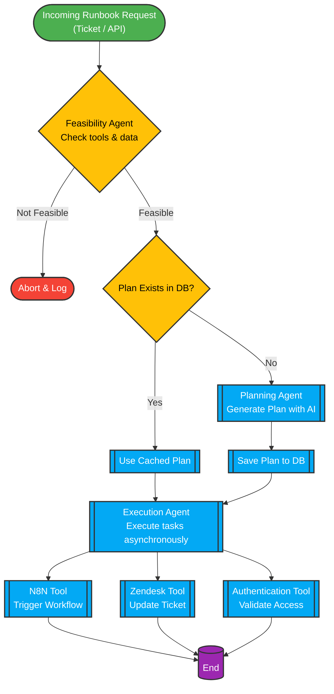
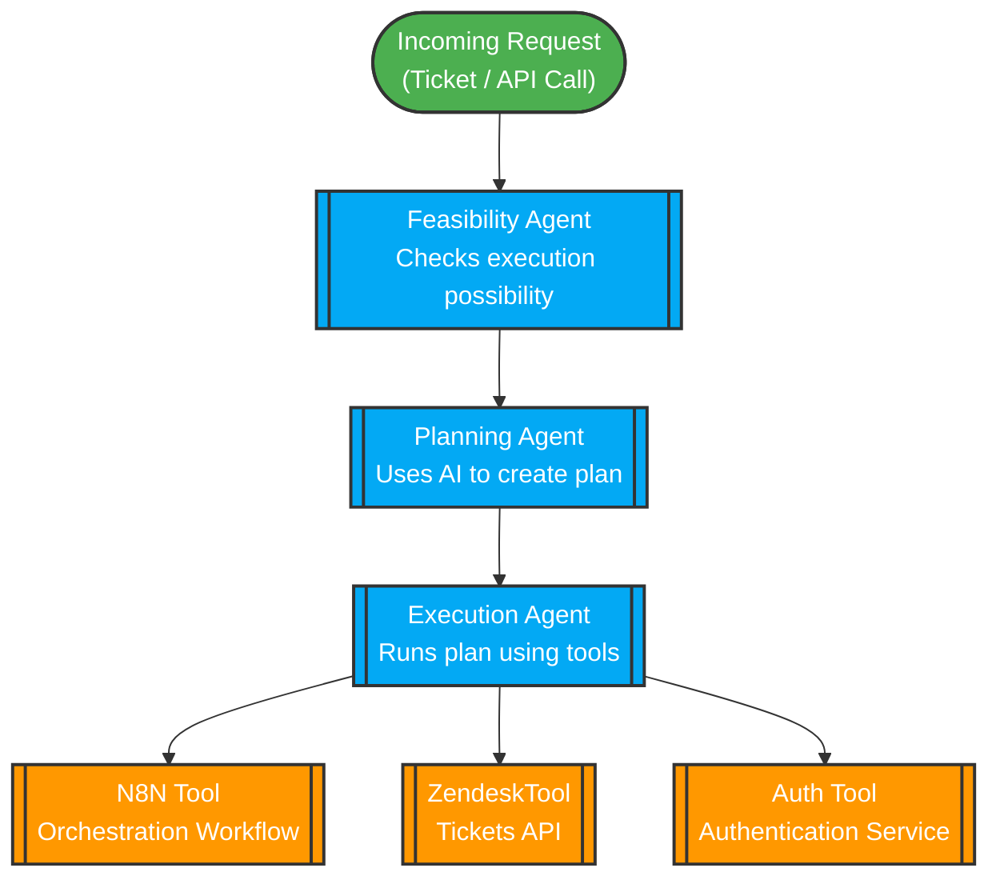
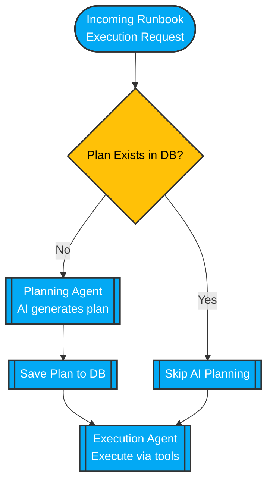

A langgraph4j, Spring AI and Qdrant with Azure Open AI sample project for Runbook Automation
This all ReadMe.md BS is Ai generated, It's just a stripped down version of an actual project. Lots of improvements are needed the way graph is generated. You dont need to actually do a plan everytime, You can use AI to generate a plan and store that in DB. Next time it would be just figuring out if you have all the data or not. If not you can actually implement graph to retrieve this data from different sources.
# Runbook Automation

Runbook Automation is a **Spring Boot** application designed to automate operational runbooks using AI-driven agents and tool integration.  
It leverages **Spring AI**, **LangGraph4j**, and custom tools to execute and evaluate tasks with external services such as **N8N**, **Zendesk**, and authentication systems.

---

## 🚀 Features

- **Agent-based automation**
    - **Feasibility Agent**: Determines if a given runbook is feasible given available tools and context.
    - **Execution Agent**: Executes planned tasks using integrated tools.

- **Tool Integrations**
    - **N8NTool**: For triggering workflows in the n8n orchestration platform.
    - **ZendeskTool**: For ticket retrieval and updates in Zendesk.
    - **AuthenticationTool**: For secure access and validation operations.

- **AI-powered reasoning**  
  Uses **Spring AI** with Azure OpenAI models for decision-making, plan creation, and execution logic.

- **Graph-based orchestration**  
  Built with **LangGraph4j** to model processes as directed graphs with nodes (actions) and edges (decisions).

- **Observability**  
  Supports **Prometheus** metrics via Micrometer for monitoring usage and performance.

---

## 📂 Project Structure

```
src/
main/
java/io/github/kaustubhkhati/runbook/automation/
RunbookAutomationApplication.java     # Spring Boot entry point
agents/
FeasibilityAgentService.java        # AI agent to evaluate feasibility
ExecutionAgentService.java          # AI agent to execute a runbook plan
tools/
N8NTool.java                         # Integration with n8n workflows
ZendeskTool.java                     # Integration with Zendesk APIs
AuthenticationTool.java              # Authentication helper
graph/
RunbookState.java                    # State representation in runbook execution
resources/
application.yml                        # Environment configuration
build.gradle.kts                             # Gradle build definition
HELP.md                                      # Getting started references
```

---

## 📦 Dependencies

Key libraries used:

- **Spring Boot Starter**: For web, reactive, actuator, and JDBC support.
- **Azure OpenAI Spring AI**:
    - `spring-ai-azure-openai-spring-boot-starter`
    - `spring-ai-core`
    - `spring-ai-azure-openai`
    - `spring-ai-qdrant-store`
- **LangGraph4j**: Graph-based automation orchestration.
- **Jackson**: YAML and JSON parsing.
- **Micrometer Prometheus registry**: Application metrics & monitoring.
- **SQLite JDBC**: Lightweight database support.
- **Apache Commons** (`commons-lang3`, `commons-collections4`).
- **Logstash Logback Encoder**: Structured logging output (JSON).
- **Apache HttpClient5**: HTTP requests to external APIs.

---

## 🧠 How It Works

The system models automation in the following way:

1. **Feasibility Analysis**  
   The **FeasibilityAgentService** takes the `RunbookState` and uses connected tools to determine if all required actions are possible.  
   Uses AI chat completion with system prompts to evaluate context and tools available.

2. **Execution Planning**  
   If feasible, the **ExecutionAgentService** builds a plan (`KEY_PLAN` in `RunbookState`) that maps required tasks to specific tools.

3. **Execution**  
   The Execution Agent triggers tools (like N8N workflows or Zendesk updates) using asynchronous actions (`CompletableFuture`) for non-blocking execution.

4. **Tool Communication**  
   The integrated tools wrap API calls, including authentication, HTTP method handling, and orchestration triggers.

---

## 🔄 Full Workflow Diagram



**Caption:**
> End-to-end process with decisions, caching, AI planning, execution via multiple tools, and observability monitoring.

---

## 🏗 Architecture Overview



**Caption:**
> Agents decide; tools act. AI orchestrates via LangGraph4j.

---

## 🧠 Plan Re-use for Efficiency



**Caption:**
> Cached plans = fewer AI calls, faster execution, reduced cost.

---

## 🔧 Configuration

### Environment Variables / Properties
You will need to configure:

- **Azure OpenAI credentials** (`spring.ai.*`)
- **Zendesk API credentials**
- **n8n workflow endpoints**
- **Authentication service configuration**

Example YAML snippet for `application.yml`:

```yaml
spring:
  ai:
    azure:
      openai:
        api-key: YOUR_API_KEY
        endpoint: https://YOUR_ENDPOINT
n8n:
  base-url: https://n8n.yourdomain.com
  api-key: YOUR_N8N_KEY
zendesk:
  base-url: https://yourcompany.zendesk.com
  api-token: YOUR_ZENDESK_TOKEN
```

---

## 🏃 Getting Started

### Prerequisites
- Java 17+
- Gradle 8+
- An active Azure OpenAI subscription
- Access to n8n and Zendesk instances

### Build the Project
```bash
./gradlew build
```

### Run the Application
```bash
./gradlew bootRun
```
The app will start on the configured `server.port` (default: `8080`).

---

## ⚙️ Usage Flow

1. Trigger runbook automation via API or workflow.
2. The system evaluates feasibility.
    - If feasible → executes according to plan.
    - If not feasible → logs and aborts.
3. Tools interact with external systems to carry out runbook steps.
4. Monitoring and logs are available for review via actuator endpoints or Prometheus.

---

## 📊 Observability

Enable Prometheus metrics scraping by configuring:
```yaml
management:
  endpoints:
    web:
      exposure:
        include: prometheus
```
Then access:
```
GET /actuator/prometheus
```

---

## 🧪 Testing

Run unit and integration tests:
```bash
./gradlew test
```

---

## 🖇️ References

- [Spring Boot](https://spring.io/projects/spring-boot)
- [Spring AI](https://spring.ai)
- [LangGraph4j](https://github.com/fabianvf/langgraph4j)
- [n8n Workflow Automation](https://n8n.io)
- [Zendesk API Docs](https://developer.zendesk.com)